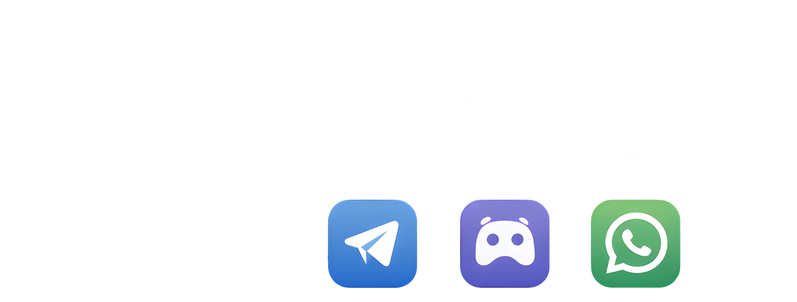

<!-- markdownlint-disable MD033 -->

<div align="center">
  
  
  <p align="center">
    Personal-first AI assistant runtime
    <br />
    Telegram • Discord • WhatsApp
    <br />
    <br />
    <a href="SETUP.md"><strong>Explore setup guide »</strong></a>
    <br />
    <a href="https://zivhm.github.io/yacb/"><strong>Visit landing page »</strong></a>
    <br />
    <br />
    <a href="https://github.com/zivhm/yacb/issues/new?template=bug_report.md">Report Bug</a>
    ·
    <a href="https://github.com/zivhm/yacb/issues/new?template=feature_request.md">Request Feature</a>
  </p>
</div>

<p align="center">
  <a href="https://github.com/zivhm/yacb/actions/workflows/ci.yml">
    
  </a>
  <a href="https://www.python.org/downloads/">
    
  </a>
  <a href="https://docs.astral.sh/uv/">
    
  </a>
  <a href="LICENSE">
    
  </a>
  <a href="https://github.com/zivhm/yacb/stargazers">
    
  </a>
  <a href="https://github.com/zivhm/yacb/fork">
    
  </a>
  <a href="https://github.com/zivhm/yacb/issues">
    
  </a>
</p>

<details>
  <summary>Table of Contents</summary>
  <ol>
    <li>
      <a href="#about-the-project">About The Project</a>
      <ul>
        <li><a href="#project-origin">Project Origin</a></li>
        <li><a href="#practical-design">Practical Design</a></li>
        <li><a href="#built-with">Built With</a></li>
        <li><a href="#capabilities">Capabilities</a></li>
      </ul>
    </li>
    <li><a href="#new-here-start-in-5-minutes">New here? Start in 5 minutes</a></li>
    <li>
      <a href="#getting-started">Getting Started</a>
      <ul>
        <li><a href="#prerequisites">Prerequisites</a></li>
        <li><a href="#installation">Installation</a></li>
        <li><a href="#using-without-a-subscription-free-tiers">Using without a subscription (free tiers)</a></li>
      </ul>
    </li>
    <li>
      <a href="#usage">Usage</a>
      <ul>
        <li><a href="#quick-commands">Quick Commands</a></li>
        <li><a href="#further-reading">Further Reading</a></li>
      </ul>
    </li>
    <li><a href="#roadmap">Roadmap</a></li>
    <li><a href="#contributing">Contributing</a></li>
    <li>
      <a href="#acknowledgments">Acknowledgments</a>
      <ul>
        <li><a href="#license">License</a></li>
        <li><a href="#contact">Contact</a></li>
      </ul>
    </li>
  </ol>
</details>

## About The Project

`yacb` which stands for "yet another clawd bot", is a personal-first AI assistant runtime for day-to-day workflows.
It focuses on predictable behavior across channels, reminders that actually
fire, and a skills-first structure that keeps the core runtime straightforward.

### Scope Status

- Scope 1 (Lean Reliability Plan) is completed as of 2026-02-23.
- Current routing model is deterministic `tier_router` (`light` / `medium` / `heavy`) with `!tier` override.
- Legacy `!light`, `!heavy`, `!think` are deprecated and replaced by `!tier`.
- WhatsApp integration is functional but still an active improvement area (self-chat/group behavior and access matching reliability).

### Project Origin

yacb began as a de-bloating exercise on [**OpenClaw**](https://github.com/openclaw/openclaw).
The goal was to strip the complexity down for predictable personal use.
Creating a personal AI companion has been a long-term goal, with earlier
iterations built on LangChain before pivoting to a more modern, skills-first
approach.

### Practical Design

- [OpenClaw](https://github.com/openclaw/openclaw) ecosystem compatibility:
  skills and agent patterns can be reused across runtimes.
- Optional per-message tier routing (`light` / `medium` / `heavy`) with
  provider-aware auto selection of light/heavy models.
- Reminder confirmations are tied to actual cron registration (no success
  message if scheduling fails).
- Proactive updates support active-hour windows and empty-response suppression.
- Optional periodic security audits flag risky config states in runtime logs.
- Model fallback retries are limited to transient failures and stop on
  non-retryable errors.
- Multi-agent routing maps `channel:chat_id` to agent-specific behavior and
  workspace state.
- Session context now rehydrates from SQLite after runtime restarts.
- Prompt context is bounded for efficiency (history + memory/skills caps) to
  reduce token growth in long chats.

### Built With

- Python `3.11+`
- `uv` (runtime and dependency workflow)
- LiteLLM provider layer
- SQLite (FTS5) + file memory
- Telegram + Discord + WhatsApp channel adapters

### Capabilities

| Area | Support |
| --- | --- |
| Providers | OpenAI · Anthropic · Gemini · DeepSeek · OpenRouter · OpenCode Zen (via LiteLLM) |
| Channels | Telegram · Discord · WhatsApp |
| Tools | Filesystem · Shell · Web · Messaging · Cron · Memory · Conversation History · Token Usage |
| Memory | File + SQLite (FTS5) |
| Scheduling | One-time · Recurring · Cron expressions |
| Routing | Per-message tier routing + provider-aware light/heavy auto resolution |
| Multi-Agent | `channel:chat_id` → named agent |
| Skills | Global + per-agent overrides |

OpenCode Zen note:

- Current `opencode/*` routing is designed for OpenAI-compatible `/chat/completions` models.
- Models that require `/responses` or `/messages` endpoints are not guaranteed with this adapter path.

## New here? Start in 5 minutes

1. Install dependencies: `uv sync`
2. Run setup: `uv run yacb init`
3. Start the bot: `uv run yacb`

Docker alternative:

1. Create config: `cp config.yaml config.docker.yaml`
2. Build image: `docker compose build`
3. Initialize config: `docker compose run --rm yacb init config.docker.yaml`
4. Start runtime: `docker compose up -d`
   (local CLI flow still uses `config.local.yaml` by default)

### Using without a paid subscription (free tiers)

You can use OpenCode, OpenRouter or Google Gemini's free tier subscriptions by choosing them as providers rather than OpenAI or Anthropic.

- **OpenCode Zen**: pick one of the free-tier models.
- **OpenRouter**: pick a model tagged `:free`.
- **Google Gemini**: use the Gemini free tier from Google AI Studio.

In setup (`uv run yacb init`), choose one of these providers and select a
free model in Step 3.

Tip: free models are great for onboarding testing, and casual day to day use.
If you need more performance you can change models later without changing or affecting your workflow.

Full guide: [`SETUP.md`](./SETUP.md)  
Command reference: [`COMMANDS.md`](./COMMANDS.md)

## Getting Started

### Prerequisites

- Python `3.11+`
- `uv`
- At least one provider API key
- At least one channel credential (Telegram, Discord, or WhatsApp)

### Installation

1. Clone the repository.

   ```bash
   git clone https://github.com/zivhm/yacb.git
   cd yacb
   ```

2. Install base dependencies.

   ```bash
   uv sync
   ```

3. Optional extras.

   ```bash
   uv sync --extra dev
   ```

4. Run guided setup.

   ```bash
   uv run yacb init
   ```

5. Start runtime.

   ```bash
   uv run yacb
   ```

If needed use an explicit config path:

```bash
uv run yacb /path/to/config.local.yaml
```

### Docker

1. Create config (first run only).

   ```bash
   cp config.yaml config.docker.yaml
   ```

   `config.docker.yaml` is the compose-specific config file.
   Keep using `config.local.yaml` for local `uv run yacb ...` workflows.

2. Build the container image.

   ```bash
   docker compose build
   ```

3. Run setup inside the container (interactive).

   ```bash
   docker compose run --rm yacb init config.docker.yaml
   ```

4. Start runtime.

   ```bash
   docker compose up -d
   ```

5. Follow logs / stop.

   ```bash
   docker compose logs -f yacb
   docker compose down
   ```

For full setup details, see `SETUP.md`.

## Usage

### Quick Commands

```bash
# start setup
uv run yacb init

# run with default runtime config
# (prefers config.local.yaml, falls back to config.yaml)
uv run yacb

# run with explicit config path
uv run yacb /path/to/config.local.yaml
```

In chat:

```text
hello
what's 2+2?
remind me in 20 minutes to stand up
what did we discuss about onboarding yesterday?
```

### Further Reading

- Command reference: `COMMANDS.md`
- Setup/onboarding: `SETUP.md`
- Runtime details and changes: `CHANGELOG.md`
- Development and contribution workflow: `CONTRIBUTING.md`

## Roadmap

- Improve observability around reminder/heartbeat delivery
- Add more operational docs and production hardening guides
- Expand container deployment hardening and production examples
- General prompt, logic, and performance optimizations based on usage
  patterns

See open issues for active proposals and known gaps:  
[https://github.com/zivhm/yacb/issues](https://github.com/zivhm/yacb/issues)

## Contributing

Contributions are welcome.

- Read `CONTRIBUTING.md`
- Open a bug/feature issue first for larger changes
- Prefer skills-first additions when possible

## Acknowledgments

- [OpenClaw](https://github.com/openclaw/openclaw) architecture patterns
- Implementation ideas inspired by other projects in the space
- [Best README Template](https://github.com/othneildrew/Best-README-Template) for structure inspiration
- [Shields.io](https://shields.io/) for badge assets

### License

Distributed under the MIT License. See `LICENSE`.

## Personal Project Notice

This is a personal, work-in-progress project.
It will probably grow based on my daily needs. Use it carefully and verify
important actions before relying on them in real workflows. You are responsible
for how you configure and use the runtime.

<p align="center"></p>

<!-- markdownlint-enable MD033 -->
